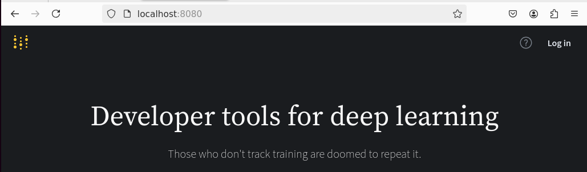
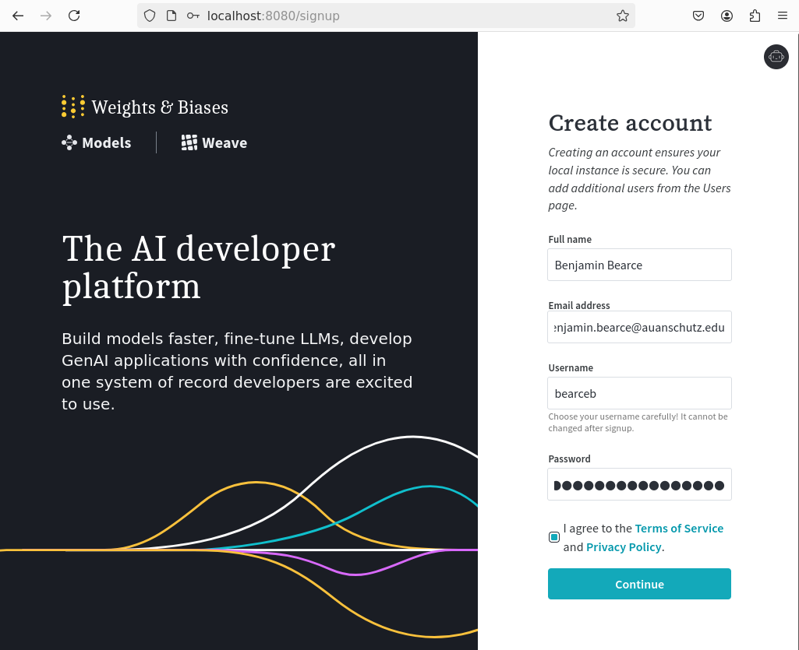
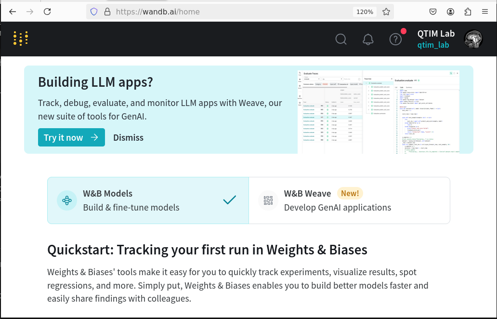
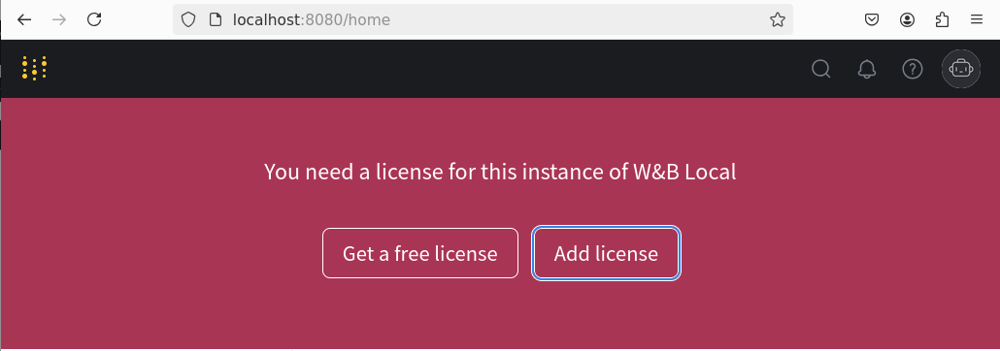
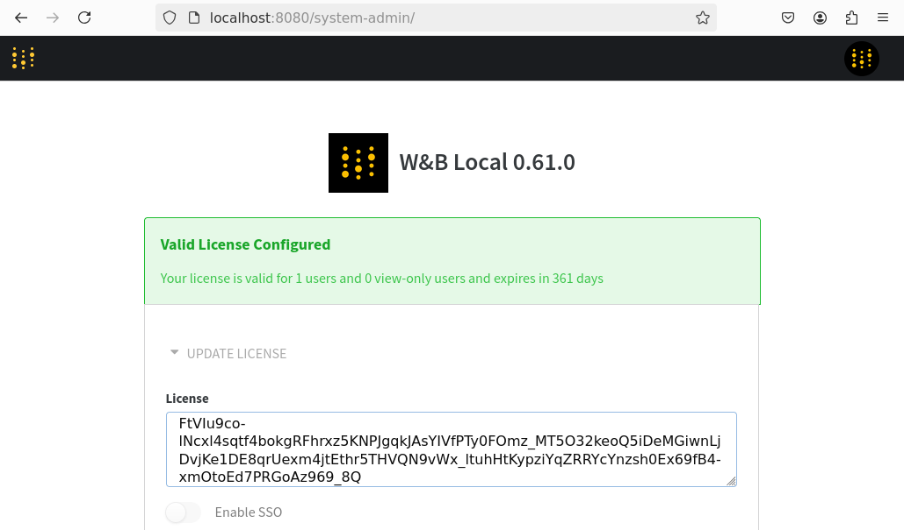
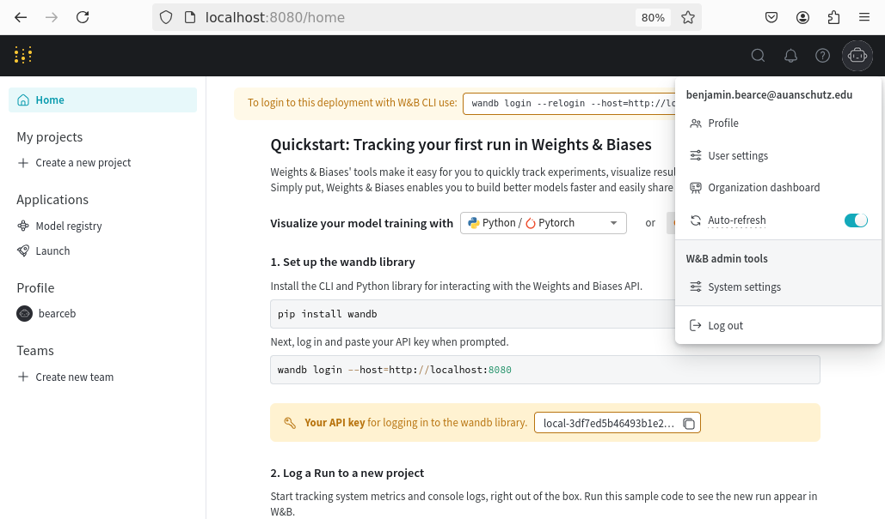
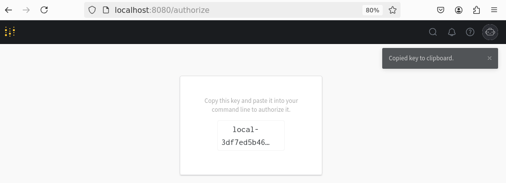
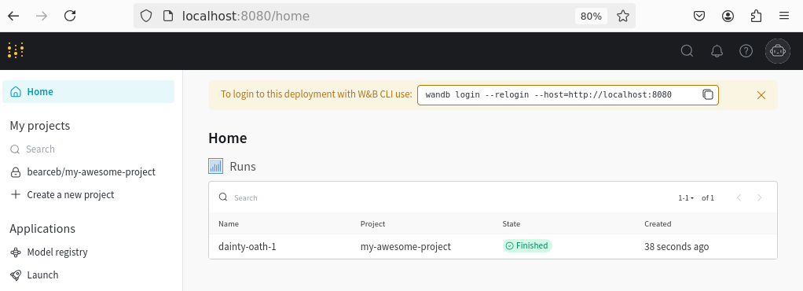
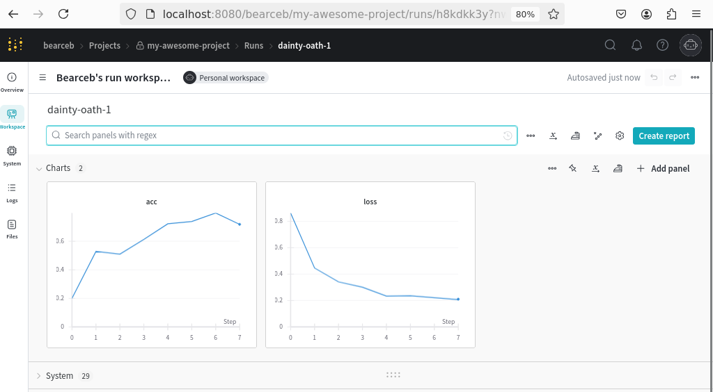
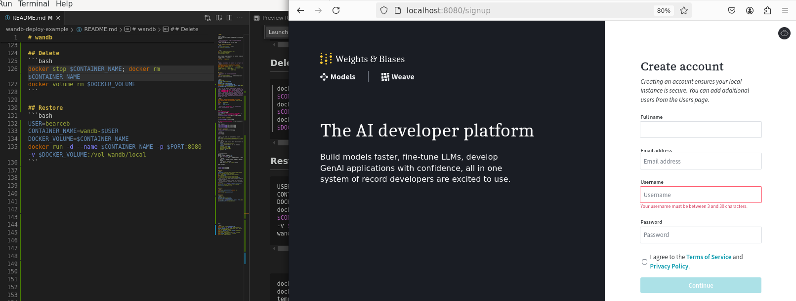

# wandb

> Some inspiration (# https://github.com/wandb/server/issues/66)
A guide to using the free tier of wandb

## Find some scratch space
```bash
SUBFOLDER=bb-10_25_2024 # example
cd /scratch90/$SUBFOLDER
```

```bash
git clone git@github.com:QTIM-Lab/wandb-deploy-example.git
cd wandb-deploy-example
```

Check if your co-workers have one running so you can change the port if needed.
```bash
docker ps | grep wandb
```

Ex:
> 8080 is consumed at the moment, use diff port below
```bash
bearceb@ophlapps04:/scratch90/bb-10_25_2024/wandb-deploy-example$ docker ps | grep wandb
5348dc0d2184   wandb/local              "/sbin/my_init"          3 hours ago     Up 3 hours   0.0.0.0:8080->8080/tcp, :::8080->8080/tcp                       wandb-local
```

## Launch
> Assuming no one is running a wandb
```bash
pyenv activate wandb_3.12.3 # need wandb package installed `pip install wandb`
```

```bash
USER=bearceb
CONTAINER_NAME=wandb-$USER
PORT=8080
DOCKER_VOLUME=$CONTAINER_NAME
docker volume create $DOCKER_VOLUME
docker run -d --name $CONTAINER_NAME -p $PORT:8080 -v $DOCKER_VOLUME:/vol wandb/local
```
> Don't use the default docker volume "wandb" as someone likely is and there will be collisions. FYI: Using `$DOCKER_VOLUME:/vol` mounts a docker volume named `$DOCKER_VOLUME` to `/vol` in container and **not** a host folder location. Docker searches the docker volume name space first and then if a volume doesn't exist by specified name it mounts to local host machine folder path and creates those folders if they don't exist.

```bash
(wandb_3.12.3) bearceb@ophlapps04:/scratch90/bb-10_25_2024/wandb-deploy-example$ docker volume list
DRIVER    VOLUME NAME
local     wandb
local     wandb-bearceb
```

Check it:
`http://localhost:8080/`

Click or enter: `http://localhost:8080/login` -> redirect -> `http://localhost:8080/signup`


## Make account or use QTIM's



See `qtim_one_time_license.md` for our license for a free tier

Enter license:




## Create sample data


```python
import wandb
import random


# start a new wandb run to track this script
wandb.login(key="local-ac9ca6c54d9509ec1dac94cc7c3bd844779265d0")
wandb.init(
    # set the wandb project where this run will be logged
    project="my-awesome-project",
    # track hyperparameters and run metadata
    config={
    "learning_rate": 0.02,
    "architecture": "CNN",
    "dataset": "CIFAR-100",
    "epochs": 10,
    }
)

# simulate training
epochs = 10
offset = random.random() / 5
for epoch in range(2, epochs):
    acc = 1 - 2 ** -epoch - random.random() / epoch - offset
    loss = 2 ** -epoch + random.random() / epoch + offset
    # log metrics to wandb
    wandb.log({"acc": acc, "loss": loss})

wandb.finish()
```




## Backup
```bash
BACKUP_DIR=/scratch90/bb-10_25_2024/wandb_backup
RUN=run-20241027_233842-vfp2lpfv
cp -r wandb/$RUN /scratch90/bb-10_25_2024/wandb_backup/$RUN
# Below /vol is the wandb-<user> container's docker volume mount point.
# So when using --volumes-from we can access that 
# containers docker volume at /vol from this ubuntu container.

docker run --rm --volumes-from $CONTAINER_NAME -v $BACKUP_DIR:/backup ubuntu tar cvf /backup/wandb_"$USER"_backup.tar -C /vol .
```

## Delete
```bash
docker stop $CONTAINER_NAME; docker rm $CONTAINER_NAME
docker volume rm $DOCKER_VOLUME
docker volume list
docker ps | grep wandb
```

## Restore
```bash
USER=bearceb
CONTAINER_NAME=wandb-$USER
DOCKER_VOLUME=$CONTAINER_NAME
```


Repopulate docker volume from backup:
```bash
docker volume create $DOCKER_VOLUME 
# Use a temporary container to extract the backup directly into the volume
docker run --rm -d --name temp_container -v $DOCKER_VOLUME:/restore -v $BACKUP_DIR:/backup busybox sh -c "sleep 3600"
docker exec temp_container tar -xvf /backup/wandb_"$USER"_backup.tar -C /restore
docker run -d --name $CONTAINER_NAME -p $PORT:8080 -v $DOCKER_VOLUME:/vol wandb/local
docker stop temp_container
```


